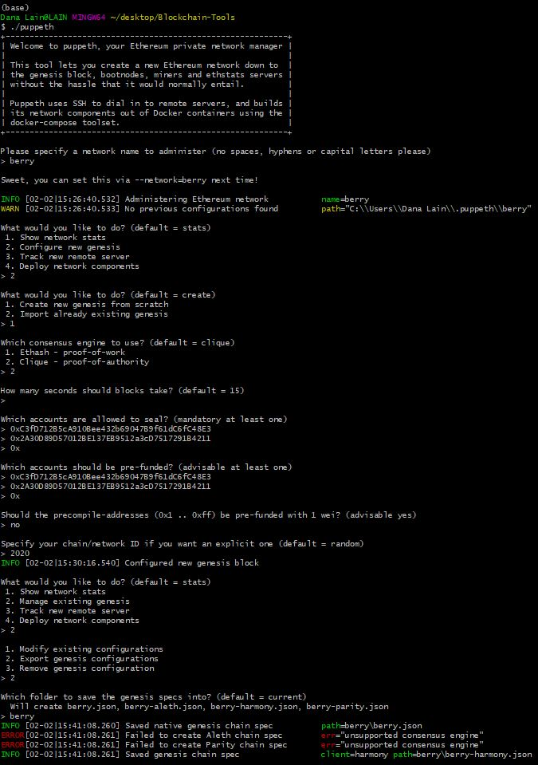
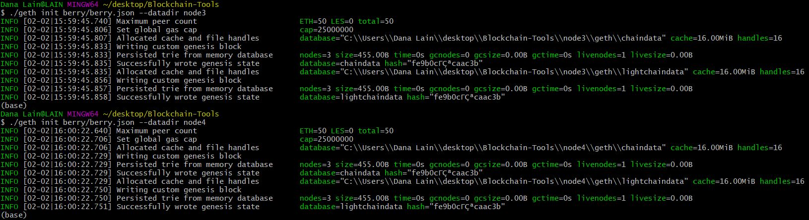
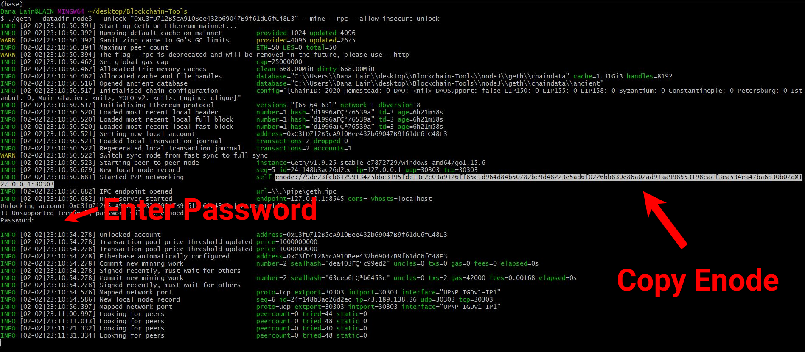
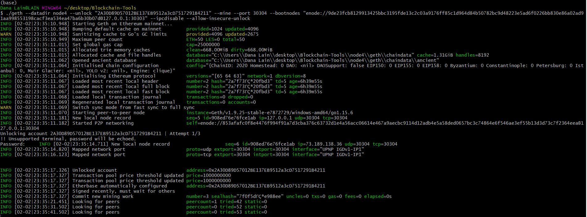
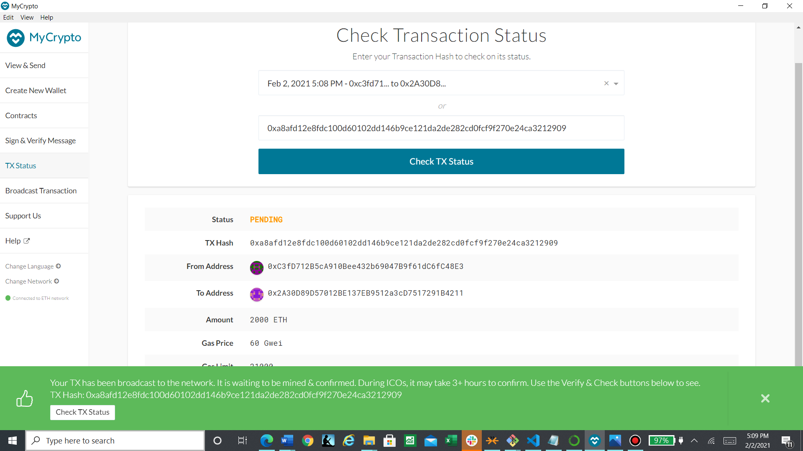

# Proof of Authority Development Chain
---

## Prompt

For this assignment, you will take on the role of a new developer at a small bank. Your mission, should you choose to accept it, will be to set up a testnet blockchain for your organization.

To do this, you will create and submit four deliverables:

* Set up your custom testnet blockchain.

* Send a test transaction.

* Create a repository.

* Write instructions on how to use the chain for the rest of your team.
---

## Background

You have just landed a new job at ZBank, a small, innovative bank that is interested in exploring what blockchain technology can do for them and their customers. Your first project at the company is to set up a private testnet that you and your team of developers can use to explore potentials for blockchain at ZBank.

You have decided on setting up a testnet because:

1. There is no real money involved, which will give your team of developers the freedom to experiment.

2. Testnets allows for offline development.

In order to set up a testnet, you will need to use the following skills/tools we learned in class:

* Puppeth, to generate your genesis block.

* Geth, a command-line tool, to create keys, initialize nodes, and connect the nodes together.

* The Clique Proof of Authority algorithm.

Tokens inherently have no value here, so we will provide pre-configured accounts and nodes for easy setup.

After creating the custom development chain, create documentation for others on how to start it using the pre-configured nodes and accounts. You can name the network anything you want, have fun with it!

Be sure to include any preliminary setup information, such as installing dependencies and environment configuration.

---

# Instructions

## Installation

For the testnet to work, you need to install MyCrypto and GoEthereum.

1. Install MyCrypto from the following link [MyCrypto](https://www.mycrypto.com/)
2. Download [Go Ethereum](https://geth.ethereum.org/), one of the three Ethereum protocol implementations. Select the version that is appropriate for your operating system.
3. Unzip the GoEthereum folder into a new folder and rename it as "Blockchain-Tools" for efficient access.

## Network Configuration

### Node Creation

Because the accounts must be approved, we will generate two new nodes with new account addresses that will serve as our pre-approved sealer addresses. Go into your Blockchain-Tools directory using cd in command prompt or git bash.

    * Create accounts for two nodes for the network with a separate `datadir` for each using `geth`.
        * ./geth --datadir node1 account new
        * ./geth --datadir node2 account new

*node3*
    
    password = ****
    Public address of the key:   0xC3fD712B5cA910Bee432b69047B9f61dC6fC48E3
    Path of the secret key file: node3\keystore\UTC--2021-02-02T23-20-39.525987700Z--c3fd712b5ca910bee432b69047b9f61dc6fc48e3

*node4*

    password = ****
    Public address of the key:   0x2A30D89D57012BE137EB9512a3cD7517291B4211
    Path of the secret key file: node4\keystore\UTC--2021-02-02T23-21-41.069739500Z--2a30d89d57012be137eb9512a3cd7517291b4211

* __NOTE__: Since I already have node1 and node2 on my directory, I am using node3 and node4 to create new nodes for this instruction. You can use 1 and 2. Save the above information in a text file or and .env file using VS Code. Do not give out passwords whether it has values or not. Build best practices.

### Puppeth Configuration

Follow the steps and commands as laid out in the image as follow:

*blockchain network*

    network name: berry
    chain id = 2020

* __NOTE__: Put your nodes' public adress of the key as allowed to seal and pre-funded accounts. 

### Nodes Initialization

Follow the steps and commands as laid out in the image as follow:

### Blockchain Mining

Now the nodes can be used to begin mining blocks.

    *Run the nodes in separate terminal windows with the commands:
       *./geth --datadir node# --unlock "SEALER_ONE_ADDRESS" --mine --rpc --allow-insecure-unlock
       *./geth --datadir node# --unlock "SEALER_TWO_ADDRESS" --mine --port 30304 --bootnodes "enode://SEALER_ONE_ENODE_ADDRESS@127.0.0.1:30303" --ipcdisable --allow-insecure-unlock

* __NOTE__: Type your password and hit enter - even if you can't see it visually!

Following is the command for node3:

Add your enode into the text/.env file you saved your node addresses in.

*node3*
    
    password = ****
    Public address of the key:   0xC3fD712B5cA910Bee432b69047B9f61dC6fC48E3
    Path of the secret key file: node3\keystore\UTC--2021-02-02T23-20-39.525987700Z--c3fd712b5ca910bee432b69047b9f61dc6fc48e3
    enode = enode://9de23fcb8129913425bbc3195fde13c2c03a9176ff85c1d964d84b50782bc9d48223e5ad6f0226bb830e86a02ad91aa998553198cacf3ea534ea47ba6b30b07d@127.0.0.1:30303

Following is the command for node4:

* Your private PoA blockchain should now be running!

* With both nodes up and running, the blockchain can be added to MyCrypto for testing.

    * Open the MyCrypto app, then click `Change Network` at the bottom left:

    

    * Click "Add Custom Node", then add the custom network information that you set in the genesis.

    * Make sure that you scroll down to choose `Custom` in the "Network" column to reveal more options like `Chain ID`:

    

    * Type `ETH` in the Currency box.
    
    * In the Chain ID box, type the chain id you generated during genesis creation.

    * In the URL box type: `http://127.0.0.1:8545`.  This points to the default RPC port on your local machine.

    * Finally, click `Save & Use Custom Node`. 

* After connecting to the custom network in MyCrypto, it can be tested by sending money between accounts.

    * Select the `View & Send` option from the left menu pane, then click `Keystore file`.

    

    * On the next screen, click `Select Wallet File`, then navigate to the keystore directory inside your Node1 directory, select the file located there, provide your password when prompted and then click `Unlock`.

    * This will open your account wallet inside MyCrypto. 
    
    * Looks like we're filthy rich! This is the balance that was pre-funded for this account in the genesis configuration; however, these millions of ETH tokens are just for testing purposes.   

    

    * In the `To Address` box, type the account address from Node2, then fill in an arbitrary amount of ETH:

     

    * Confirm the transaction by clicking "Send Transaction", and the "Send" button in the pop-up window.  

    

    * Click the `Check TX Status` when the green message pops up, confirm the logout:

    

    * You should see the transaction go from `Pending` to `Successful` in around the same blocktime you set in the genesis.

    * You can click the `Check TX Status` button to update the status.

    

* Sometimes, you may have to wait longer than usual for the transaction to complete. Hence, the following transaction pending status in the image below:

Congratulations, you successfully created your own private blockchain!

### Remember, *never* share your mainnet private keys! This is a testnet, so coins have no value here!

### Hints

* If you get stuck - try our step by step PoA Guide located [here](Resources/POA-Blockchain-guide.md).

* If you aren't seeing any movement in the wallet amounts in MyCrypto after sending/receiving transactions, try the following:
    * Terminate both nodes using `control+C` in the Node1 and Node2 terminal windows.
    * Change networks in MyCrypto to a Testnet such as Kovan.
    * Restart Node1 and Node2 in their terminal windows.
    * Reconnect to your network in MyCrypto.
    * Log into your wallet and refresh the amount.
    
* If that doesn't help make sure you are sending a large enough sum of ETH to see actual movement in the digits. You may have to click on the amount itself to see the full value down to the WEI.

    
---
© 2020 Trilogy Education Services, a 2U, Inc. brand. All Rights Reserved.
